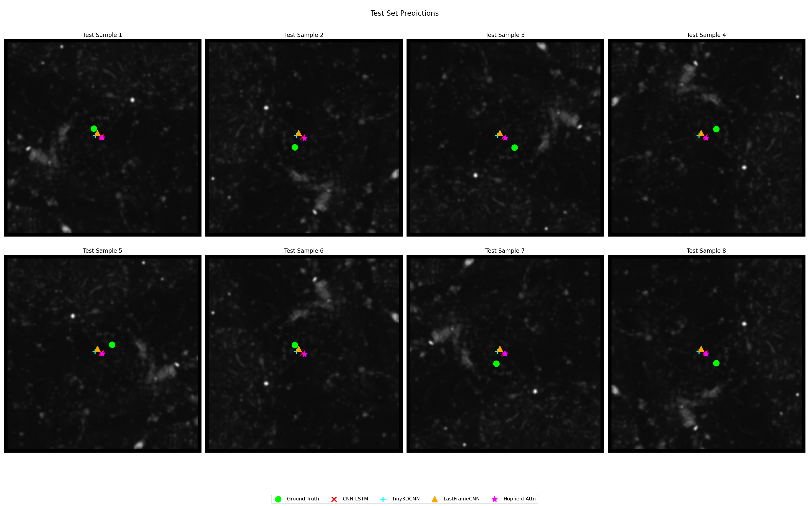
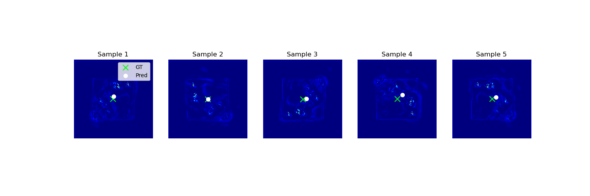

# Slime Mold Aggregation Prediction

**Spatio-Temporal Forecasting of *Dictyostelium discoideum* Aggregation Centers using Deep Learning**

[View Code](https://github.com/db-d2/stat4243_proj2/blob/main/slime_mold_local.ipynb) | [Open in Colab](https://colab.research.google.com/github/db-d2/stat4243_proj2/blob/main/slime_mold_starter.ipynb) | [Full Report](https://github.com/db-d2/stat4243_proj2/blob/main/README.md)

## Abstract

This project develops and compares deep learning architectures to predict the final aggregation center of *Dictyostelium discoideum* (slime mold) cells using only the first 50 frames of their movement. We implemented a "Clean Slate" data engineering pipeline to standardize raw microscopy movies and evaluated four distinct models: a **CNN-LSTM** for spatio-temporal feature extraction, a **Tiny3DCNN** for volumetric analysis, a **LastFrameCNN** baseline, and a novel **Hopfield-Attention** network. We also explored a **DYffusion+Hopfield** generative model to predict probability heatmaps.

## Key Results

### Model Performance
- **CNN-LSTM**: Achieved the best performance on the test set with a mean error of **42.74 µm**. It demonstrated strong stability and robustness.
- **Hopfield-Attn**: A close second with **44.62 µm** error. It showed excellent performance on the validation set but had a higher sensitivity to resolution changes.
- **LastFrameCNN**: The static baseline performed surprisingly well (**45.82 µm**), confirming that the final frame (t=50) contains the majority of the spatial signal.
- **DYffusion+Hopfield**: The generative model achieved **~60.75 µm** error. While less precise than regression models, it successfully localized the aggregation region, demonstrating the viability of dense prediction for this task.

### Robustness & Generalization
- **Temporal Robustness**: **Tiny3DCNN** improves significantly with more frames, while **CNN-LSTM** remains stable and accurate even with limited temporal context (t=10).
- **Resolution Robustness**: **CNN-LSTM** and **LastFrameCNN** were completely robust to 2x downsampling (**0.0%** drop). However, **Hopfield-Attn** suffered a **37.4%** performance drop, indicating a reliance on fine-grained features.
- **Subsampling Sensitivity**: We identified a critical sensitivity in the Hopfield model to temporally subsampled data, where zero-padding diluted the attention mechanism's effectiveness.

## Visualizations

### Regression Model Predictions
*Models predict the final aggregation center (x, y) based on early video frames. Green 'X' is Ground Truth, Red 'O' is Prediction.*

### DYffusion+Hopfield: Generative Heatmap Predictions
*The DYffusion model generates probability heatmaps rather than point coordinates. Green 'X' marks the ground truth center, while the White 'O' shows the predicted center of mass from the heatmap.*

*The heatmap approach captures spatial uncertainty and offers a richer representation of where aggregation is likely to occur, though at the cost of some coordinate precision compared to regression models.*

*(See the [Full Report](https://github.com/db-d2/stat4243_proj2/blob/main/README.md) for more detailed analysis)*

## Documentation

**Technical Report**: [View README](https://github.com/db-d2/stat4243_proj2/blob/main/README.md)

Contains the complete project writeup, including:
- Detailed Problem Statement & Approach
- Data Preprocessing Pipeline (Denoising, Resizing, Labeling)
- Model Architectures (CNN-LSTM, 3DCNN, Hopfield-Attention)
- Comprehensive Results & Overfitting Analysis
- References

## Data Availability

- **Source**: Time-lapse microscopy movies of *Dictyostelium* aggregation.
- **Processed Data**: Standardized `.pt` tensors (320x320, 2.0 µm/px).
- **Code**: `slime_mold_starter.ipynb`

---
