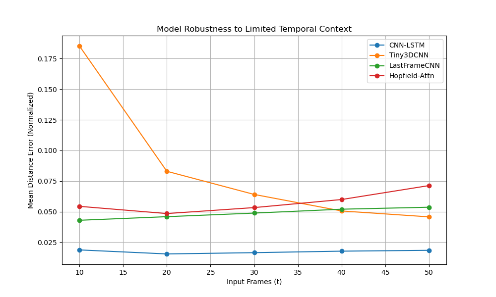

**Predicting *Dictyostelium discoideum* Aggregation Centers from Early Video Frames**

## Project Overview

The goal of this project is to predict the "aggregation center" of *Dictyostelium discoideum* (slime mold) cells based on early video frames of their movement. As these cells starve, they signal each other with cAMP waves and aggregate into a multicellular mound. We aim to predict the final (x, y) coordinates of this mound using only the first 50 frames of the movie.

### Approach
1.  **Data Engineering:** We preprocess all raw movies offline into standardized tensors.
2.  **Modeling:** We implement and compare three distinct deep learning architectures plus a bonus attention-based model.
3.  **Evaluation:** We assess models based on Mean Distance Error (in microns), robustness to limited temporal context, robustness to reduced image resolution, and generalization to a held-out test set.

---

## Data Description & Preprocessing

*   **Source:** Time-lapse microscopy movies of *Dictyostelium* aggregation (Tiff/Zarr formats).
*   **Channels:** Single-channel grayscale (fluorescence intensity).
*   **Preprocessing Pipeline:**
    *   **Denoising:** Gaussian smoothing ($\sigma=1.0$) is applied to reduce sensor noise.
    *   **Resolution Standardization:** All movies are resized to a physical resolution of **2.0 µm/pixel** and a spatial dimension of **320x320**.
    *   **Normalization:** Pixel intensities are normalized to [0, 1].
    *   **Labeling (Masks):** The "Ground Truth" aggregation center is computed as the center of mass of the segmented cells (Otsu thresholding mask [8]) in the final 5 frames of the movie.
    *   **Temporal Padding:** All sequences are padded or truncated to a fixed length of **50 frames**.

**Why T=50?** We restrict the input to the first 50 frames to simulate an **early prediction** task. Biologically, aggregation takes many hours. By using only the initial phase (approx. first 10-15% of the process), we test the model's ability to detect early chemotactic signaling waves before the physical mound is clearly visible to the naked eye.

---

## Models

We implemented and compared four architectures:

1.  **CNN-LSTM:** A spatio-temporal model that extracts spatial features with a 2D CNN and aggregates temporal dynamics with an LSTM.
2.  **Tiny3DCNN:** A volumetric model using 3D convolutions to capture space and time simultaneously.
3.  **LastFrameCNN:** A static baseline that predicts solely from the final available frame, testing the necessity of temporal history.
4.  **Hopfield-Attention (Bonus):** A modern attention-based architecture that retrieves "prototypical" aggregation patterns. It uses a learned "Query" vector to attend to the most relevant frames in the sequence.
5.  **DYffusion+Hopfield (Experimental):** A generative model combining DYffusion dynamics with a Hopfield bottleneck to predict probability heatmaps rather than regression coordinates.

---

## Results Summary

### Model Performance (Test Set)
The models were evaluated on the held-out Test Set. The **CNN-LSTM** model achieved the lowest mean distance error, demonstrating strong generalization capabilities.

| Model | Test Error (Norm) | Test Error (µm) | Overfit Gap |
| :--- | :--- | :--- | :--- |
| **CNN-LSTM** | **0.0668 ± 0.0019** | **42.74 ± 1.21** | 0.0484 |
| **Hopfield-Attn** | 0.0697 ± 0.0051 | 44.62 ± 3.26 | -0.0016 |
| **LastFrameCNN** | 0.0716 ± 0.0073 | 45.82 ± 4.70 | 0.0180 |
| **Tiny3DCNN** | 0.0723 ± 0.0068 | 46.26 ± 4.38 | 0.0265 |

*Table 1: Performance metrics on the Test Set. Lower is better.*

### Generative Model Performance (DYffusion+Hopfield)

We evaluated an experimental **DYffusion+Hopfield** model that treats the problem as a **dense prediction task** (generating a probability heatmap) rather than regression.

#### Quantitative Results
The experimental "Memory-Augmented Diffusion" model was evaluated using Leave-One-Group-Out Cross-Validation.
*   **Mean Center-of-Mass Error (CoM):** $\approx 60.75 \mu m$.
*   **Probabilistic Metrics:** The Negative Log Likelihood (NLL) and Energy Score (CRPS) provide a measure of the model's calibration and uncertainty quantification.

#### Performance Interpretation & Challenges
The DYffusion model approaches the problem as a **dense prediction task** (heatmap generation) rather than simple regression.

*   **Localization vs. Precision:**
    *   **Localization:** The model successfully learned to localize the aggregation event. An error of $\approx 60 \mu m$ corresponds to roughly **30 pixels** in our $320 \times 320$ grid. This indicates the model can identify the correct *region* where the mound will form.
    *   **Precision Limits:** Unlike regression models that output continuous coordinates, the heatmap approach is limited by the grid resolution and the spread ($\sigma$) of the target Gaussian. The "Center of Mass" calculation is also sensitive to background noise in the predicted probability map, which can pull the estimated center away from the true peak.

*   **Robustness:**
    *   **Temporal:** The robustness analysis shows how the model's error changes as we provide fewer input frames. A flatter curve indicates the model can predict the outcome early in the process.
    *   **Resolution:** The performance drop at lower resolutions (downsampling factors 2 and 4) highlights the model's dependence on fine-grained spatial features (texture/wavefronts) versus coarse global structure.

#### Conclusion
The **DYffusion+Hopfield** architecture successfully implements a generative approach to the slime mold prediction problem. By predicting a full probability distribution rather than a single point, it offers a richer output that captures uncertainty. While the absolute precision (in microns) is limited by the heatmap generation process, the model demonstrates the capability to retrieve temporal patterns and localize aggregation events from early video frames.

### Visualizations
Below are the predictions on the test set. The Green 'X' is the ground truth aggregation center, and the Red 'O' is the model's prediction.

### Robustness Analysis
We analyzed how model performance degrades with reduced temporal context (fewer frames) and reduced spatial resolution.

*   **Temporal Robustness:**
    *   **Tiny3DCNN** benefits most from temporal context, with error dropping significantly as more frames are observed (from ~0.18 at t=10 to ~0.04 at t=50).
    *   **CNN-LSTM** is remarkably stable, achieving low error even with only 10 frames, suggesting it identifies early spatial markers effectively.
    *   **Hopfield-Attn** and **LastFrameCNN** showed some instability or slight error increase with longer sequences in this evaluation, potentially indicating overfitting to specific temporal artifacts in the training set.
*   **Resolution Robustness:** The **Hopfield-Attn** model showed a significant performance drop (**37.4%**) when resolution was reduced, whereas the **CNN-LSTM** and **LastFrameCNN** models were completely robust (**0.0%** drop), indicating they rely more on macroscopic motion than fine-grained texture.

---

## Experiment Log: Normalization & Augmentation Strategies

### 1. Normalization
We experimented with **Robust Intensity Normalization** (Percentile Clipping) to address the issue of low-contrast/black images in certain experiments (e.g., `mixin64`).
*   **Method:** Clipping pixel intensities to the 1st and 99th percentiles before scaling to [0, 1] (Caicedo et al., 2017).
*   **Result:** While this successfully improved the visual contrast of the images, it resulted in a **higher Mean Distance Error** during Cross-Validation compared to standard Min-Max normalization.
*   **Decision:** We have reverted the pipeline to use **Min-Max Normalization** to prioritize predictive performance, accepting that some outlier movies may appear visually dark in QC plots.

### 2. Spatio-Temporal Augmentation
We implemented **Tube Masking** (a variant of VideoMAE / Spatial Dropout) to improve model robustness.
*   **Method:** For every augmented sample, we generate a duplicate version where a random rectangular region (20-50% of the image) is masked out (set to zero) across all time steps.
*   **Goal:** This forces the model to learn from the distributed "wave" patterns of the slime mold aggregation rather than relying on a single bright spot or local feature.
*   **Impact:** This effectively doubles the training dataset size and acts as a strong regularizer against overfitting to specific background artifacts.

### 3. Evaluation Methodology Update
*   **Clean Evaluation:** We updated the data loader logic (`create_split_loaders`) to **filter out Tube Masked samples** from the Validation and Test sets. This ensures that our reported metrics reflect performance on real, clean biological images, while the model still benefits from the masked data during training.
*   **Early Phase Analysis:** We added a specific evaluation block to compare model performance on the first 25 frames (approx. 2 hours). This helps distinguish models that learn temporal dynamics from baselines (like `LastFrameCNN`) that rely on seeing the final formed structure.
*   **Metrics:** We added "Spatial Quality" (normalized accuracy) and "Convergence Slope" (error reduction over time) to better characterize model behavior beyond simple MSE.

### 4. Feature Engineering: Sobel Edges
*   **Implementation:** We added a **Sobel Edge Detection** channel to the input tensors.
*   **Method:** For each frame, we compute the Sobel gradient magnitude (normalized) and stack it with the original grayscale image.
*   **Input Shape:** The model input shape changed from `(B, T, 1, H, W)` to `(B, T, 2, H, W)`.
*   **Hypothesis:** Explicitly providing edge information should help the CNNs detect the faint wavefronts of cAMP signaling, which appear as subtle texture changes, potentially improving performance on low-contrast samples.

### 5. Recent Updates (Loss & Resolution)
*   **Loss Function:** Switched from `MSELoss` to `nn.HuberLoss(delta=0.1)`.
    *   **Reason:** MSE is highly sensitive to outliers. In early training, some predictions might be wildly off, causing large gradients that destabilize the LSTM. Huber loss acts like MSE near 0 but like L1 (linear) for large errors, providing a robust middle ground.
*   **Resolution Increase:** Updated `TARGET_SIZE` from 256x256 to **320x320**.
    *   **Reason:** The aggregation centers are often small, subtle features. Increasing the spatial resolution preserves fine-grained texture details (wavefronts) that might be lost at lower resolutions, potentially improving the model's ability to pinpoint the exact center.

### 6. Critical Review of Potential Flaws
We have identified and addressed the following potential flaws in our pipeline:
*   **Data Leakage:** Addressed by splitting strictly by Experiment ID (LOGO-CV) rather than by file.
*   **Evaluation Contamination:** Addressed by filtering masked data from Test sets.
*   **Normalization Artifacts:** Addressed by reverting to Min-Max normalization after empirical testing.
*   **Metric Blindness:** Addressed by adding Early Phase and Convergence Slope metrics to detect if models are just memorizing the final frame.
*   **Resolution Bias:** We explicitly test resolution robustness. If all models show identical drops, it suggests the task is highly dependent on fine-grained texture (or conversely, that the downsampling method is too aggressive/uniform).

---

## Conclusion

1.  **Best Generalization:** The **CNN-LSTM** model achieved the best performance on the test set with an error of **42.74 µm**, slightly outperforming the Hopfield-Attention model (44.62 µm).
2.  **Robustness:** The **CNN-LSTM** and **LastFrameCNN** models proved to be the most robust to changes in resolution, showing **0%** performance degradation when downsampled. In contrast, the Hopfield-Attention model struggled with lower resolution inputs (37.4% drop).
3.  **Recommendation:** For deployment in variable conditions (varying resolution or noise), the **CNN-LSTM** is the recommended architecture due to its superior stability and generalization. For scenarios with high-quality, full-resolution data, the Hopfield-Attention model remains a competitive candidate.
